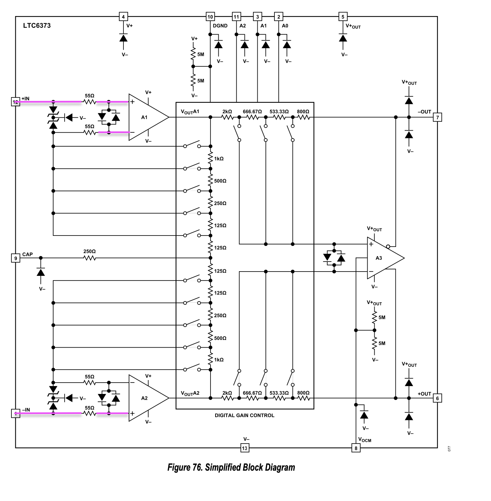
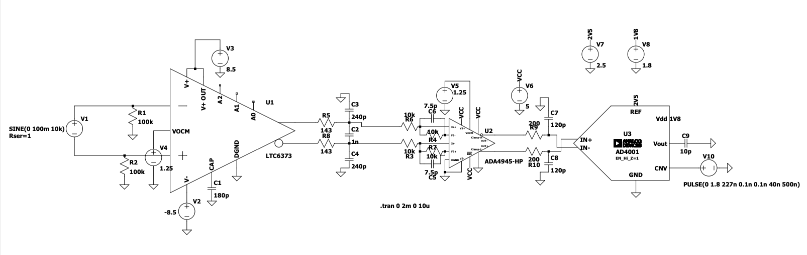

## Analog frontend

* Programmable Gain Amplifier which amplifies the truly-bipolar signal from the hydrophone and shifts the output-common-mode-voltage ( \(V_{OCM}\) ) to 1.25V
    * LTC6373

### LTC6373

* the effective input resistance between In+ and In- is about \(5 \times 10^{12} \Omega\). The impedance of the pickup coil is in comparison very small. How should we address 

!!! note "Question about input impedance at first stage PGA"
    Should we do smt about the fact that the pickup coil has a very low impedance while the PGA has an _very_ high input impedance ?

* Tow weak pull-down resistors are included before the LTC6373 to ensure the input common mode voltage stays around 0V (`R12`,`R13`)
    * Make sure that this does not introduce input source impedance imbalance as this can very quickly degrade CMRR

The datasheet explicitely mentions that _"A DC path must be provided for the input bias currents of both inputs when a purely differential signal is being amplified"_ so maybe we should keep two resistors then

!!! note "Must consider input current return bias"
    Is that already taken into account with the weak pull-down resistors ? 

According to the datasheet, *the output voltage range depends on whether the LTC6373 differential output is sourcing (\(i_L <0\)) or sinking  (\(i_L > 0\)) current*. Make sure that is sorted out by looking at the input bias of the *ADC driver block*.

!!! alert "To consider"
    More loading from filtering stage (ADC driver block) means reduced output voltage swing at LTC6373 output ! (See figure 61 _"Output voltage swing vs load current and load resistance"_ on Datasheet)

- RFI rectification : High frequency noise couples into coax cable -> generates a DC offset inside the LTC6673
> To cope with this phenomenom it might be necessary to add a LPF (1st order passive RC network is enough) to remove this HF noise

- I chose the `#PBF` option. All four available packages use the DFN footprint, they just differ in temperature range)

Datasheet says input bias current is 25pA max => does that imply anything about the suitable series resistance to put b/w twinax output and LTC6373 input ? 

!!! alert "Checklist to ensure"
    The output common mode voltage (\(V_{OCM}\)) for the LT6373 (=1.25V) is within \(V_{-}+1.5\) and  \(V_{+}-1.5\)

A requirement for the LTC6373 is that the difference between \(V_{+}\) and (\(V_{-}\) (let \(V_s=V_{+}-V_{-}\) _is at least 9V_.

The LTC6373 only accepts an input common mode voltage within -3V to +3V for a +/- 5V power input (for other input voltages Vs see the "Diamond plot")

### MISC

Great resources : [Fully-Differential Amplifiers, Application Report, Texas Instruments 2016](https://www.ti.com/lit/an/sloa054e/sloa054e.pdf)

Another great resource : ["AN 2555 : True bipolar input fully differential output ADC driver design"](https://www.analog.com/media/en/technical-documentation/app-notes/an-2555.pdf)

Another great resource from AD : [AN-1026](https://www.analog.com/media/en/technical-documentation/app-notes/an-1026.pdf)

Another great resource (add the pdf link here) : "Generating Negative voltages from a positive voltage supply (Technical article from AD)"

Great resource from TI : "Fully Differential Op Amps Made Easy"(Application Note,2002)

Great resource from AD : "Generating Negative Voltages from a Positive Voltage Supply: Market Requirements and Solutions"

According to that application report, a FDA generates a "virtual short" between the differential inputs, provided that the a(f) >> 1. But for the LTC6373 the input impedance is much greater (see [power section](/power)). Also compare that "Figure 76. Simplified Block Diagram" in the LTC6373 datasheet.
55 \( \ohms \) then there is extra internal impedance in A1 and A2. 

There seems to be only 55 Ohms series resistors at the input stage (IN-/IN+) but then how does that translate to a M-ohms. 

- Q : should we place a LPF at the very first stage (i.e between twinax and PGA) ? in order to minimize HFI ? What cutoff frequency would we choose such that it is sufficiently \(above 2*f_{max}\)

Simulation on  LTSpice yielded very positive results : 

