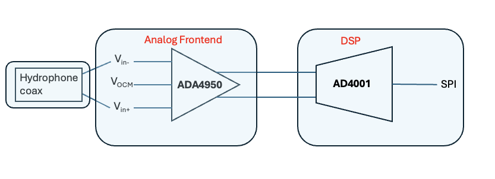

## Design of the Signal Chain 

The main components that make up the signal chain are : 

* The analog frontend, which consists of the hydrophone and the preamplifier (ADC driver ADA4950, a FDA)
* The DSP, which consists of the main ADC (AD4001) which sends the digitalized signal over SPI to the MCU
* The voltage reference block, which provides the ADC reference voltage as well as the FDA common mode voltage. 

### Analog Frontend 

Current considerations to take into account for later and current iterations : 

* Make sure that the input and output voltage range swing is supported by the FDA, given its operating on a single supply
* Maybe add a provisional passive RC filter before the FDA to prevent aliasing of high frequency noise, and that cannot be undone digitally afterwards. Note that the RC filter between the FDA and ADC (aka the "kickback filter") serves a different purpose and does not substitute an anti-aliasing filtger.

### DSP

### List of components with their footprint 

| IC              | function                          | package type | KiCAD library |
|-----------------|-----------------------------------|--------------| -------| 
| ADP7118ARDZ-1.8 | 1.8V LDO                          | 8-SOIC-EP    | [ultra-librarian](https://vendor.ultralibrarian.com/adi/embedded?vdrPN=ADP7118ARDZ-1.8) | 
| ADP7118ARDZ-3.3 | 3.3V LDO                          | 8-SOIC-EP    | [ultra-librarian](https://vendor.ultralibrarian.com/adi/embedded?vdrPN=ADP7118ARDZ-3.3) |
| LTC3265EFE#PBF | charge pump (+/-8.5V)             | 20-TSSOP	    | [ultra-librarian](https://vendor.ultralibrarian.com/adi/embedded?vdrPN=LTC3265EFE%23PBF) |
|LTC6373SDFM#PBF | PGA In-amp                        | 12-DFM       | [ultra-librarian](https://vendor.ultralibrarian.com/adi/embedded?vdrPN=LTC6373SDFM%23PBF) | 
| LTC6655BHMS8-1.25#PBF| Precision 1.25V voltage reference | 8-MSOP       | [ultra-librarian](https://vendor.ultralibrarian.com/adi/embedded?vdrPN=LTC6655BHMS8-1.25%23PBF) | 
|LTC6655BHMS8-2.5#PBF | Precision 2.5V voltage reference  | 8-MSOP       | [ultra-librarian](https://vendor.ultralibrarian.com/adi/embedded?vdrPN=LTC6655BHMS8-2.5%23PBF) | 

The signal chain simulation, which was done on Analog Device's Signal Chain Designer Tool can be accessed at [this link](https://tools.analog.com/en/signalchaindesigner/#session=TKsXolXUHUuK8_GA5aznZQ&step=dEYoxybDQ0WmEA2G54wq2g)

If somehow the link is broken, you can still access the raw data and configuration by downloading [this zip file](./files/Signal%20Chain%20Designer%20data.zip)

Some resources : https://www.analog.com/en/resources/analog-dialogue/articles/next-generation-sar-adc-addresses-precison-data-acquisition.html

